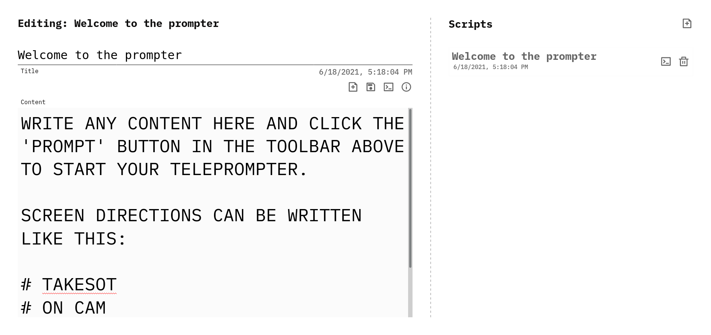
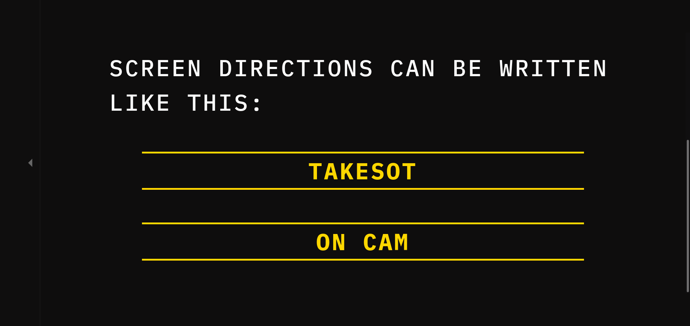
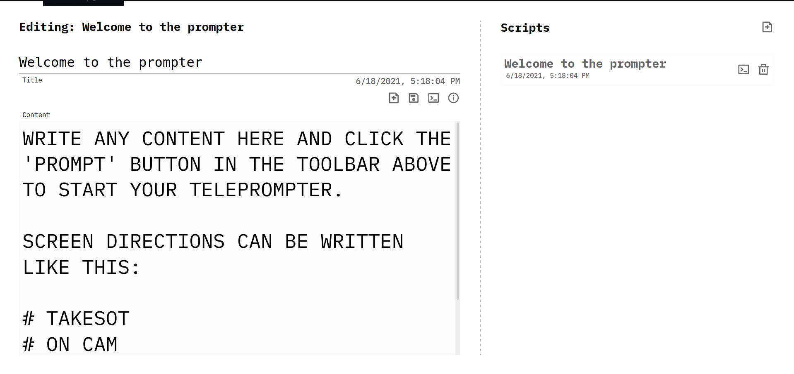

# Prompter

This is a really basic teleprompter for use in a desktop browser.

Features:

- autosave - any scripts being edited will auto-save when focus is moved out of the editor. `CTRL+S` will also save the script.
- offline-first - the editor uses LocalStorage to save scripts (networked persistance may be added in the future)
- Adjust prompter text size & mirror text
- simple screen-directions - the teleprompter parses markdown to display the script's content. That means screen-directions can be written as `# TAKESOT`, `# TAKEVO`, or `# ON CAM`.

Future features:

- networked persistence (Firebase, Fauna, Supabase ... Google Docs?)
- voice-activated scrolling
- auto-scroll at a custom speed
